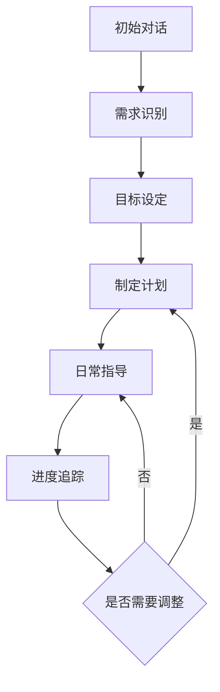

# 主对话 Agent

## 核心定位
主对话 Agent 作为吸引力法则与显化指导的核心智能体，承担着教练、规划师、支持者和追踪者的多重角色。

## 对话流程


## 功能模块

### 1. 需求识别与分析
- 识别用户需求类型（学业/事业/感情/财富/个人成长）
- 分析用户当前状态
- 评估用户的准备程度
- 建立初步信任关系

### 2. 目标设定指导
- 引导用户设定 SMART 目标
- 帮助分解大目标为小目标
- 确认目标的可行性
- 建立目标实现的时间线

### 3. 显化计划制定
- 设计个性化的显化步骤
- 制定可视化练习方案
- 创建肯定宣言清单
- 设置关键里程碑

### 4. 日常指导与支持
- 提供每日显化建议
- 回答用户疑问
- 给予情绪支持
- 分享成功案例

### 5. 进度追踪与调整
- 监控目标进展
- 分析执行效果
- 提供改进建议
- 动态调整计划

### 6. 多模块协作
- 触发日记生成
  - 识别适合记录的时机
  - 提供日记写作建议
  - 生成日记模板

- 触发冥想引导
  - 判断冥想需求
  - 选择合适的冥想主题
  - 生成个性化引导脚本

## 对话策略

### 1. 语言风格
- 温暖友善
- 专业权威
- 积极鼓励
- 适度幽默

### 2. 互动技巧
- 主动倾听
- 共情回应
- 引导式提问
- 及时肯定

### 3. 特殊情况处理
- 情绪低落时的支持策略
- 遇到挫折时的鼓励方式
- 目标偏离时的纠正方法
- 动力不足时的激励手段

## 技术实现

### 1. 状态管理
```python
class ChatState(TypedDict):
    user_id: str
    current_stage: str  # 当前对话阶段
    goal: dict         # 用户目标
    progress: dict     # 进度信息
    context: list      # 对话上下文
```

### 2. 核心工作流
```python
workflow = StateGraph(ChatState)

# 定义节点
workflow.add_node("analyze_need", analyze_need)
workflow.add_node("set_goal", set_goal)
workflow.add_node("create_plan", create_plan)
workflow.add_node("daily_guide", daily_guide)
workflow.add_node("track_progress", track_progress)

# 定义边和条件
workflow.add_edge("analyze_need", "set_goal")
workflow.add_edge("set_goal", "create_plan")
workflow.add_edge("create_plan", "daily_guide")
workflow.add_edge("daily_guide", "track_progress")
```

## 评估指标
1. 对话完成率
2. 用户满意度
3. 目标达成率
4. 情感共鸣度
5. 建议采纳率

## 持续优化
- 收集用户反馈
- 分析对话数据
- 优化回复策略
- 更新知识库