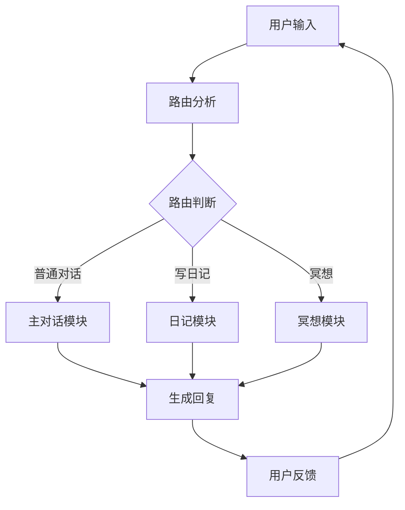

# 主对话 Agent

## 核心定位
主对话 Agent 作为吸引力法则与显化指导的核心智能体，承担着教练、规划师、支持者和追踪者的多重角色。

## 对话流程


# 功能模块

### 1. 路由分析
- 识别用户意图类型（普通对话/日记/冥想）
- 严格区分功能讨论和功能使用
- 确保用户明确同意后才触发特殊功能
- 默认保持在普通对话模式

### 2. 主对话模块
- 处理日常交互对话
- 提供情感支持和建议
- 回答用户疑问
- 引导用户使用其他功能

### 3. 日记模块
- 提供日记写作引导
- 生成日记模板
- 记录用户日记内容
- 提供写作反馈

### 4. 冥想模块
- 提供冥想引导
- 生成冥想音频
- 跟踪冥想进度
- 收集冥想反馈

### 5. 多模块协作
- 模块间平滑切换
- 状态保持与恢复
- 用户确认机制
- 会话上下文管理

## 对话策略

### 1. 语言风格
- 温暖友善
- 专业权威
- 积极鼓励
- 适度幽默

### 2. 互动技巧
- 主动倾听
- 共情回应
- 引导式提问
- 及时肯定

### 3. 特殊情况处理
- 情绪低落时的支持策略
- 遇到挫折时的鼓励方式
- 目标偏离时的纠正方法
- 动力不足时的激励手段

## 技术实现

### 1. 状态管理
```python
# 路由状态
class RouterState(TypedDict):
    messages: Annotated[list[AnyMessage], add_messages]
    route: Literal["diary", "meditation", "normal_chat"]

# 日记状态
class DiaryState(TypedDict):
    messages: Annotated[list[AnyMessage], add_messages]

# 冥想状态
class MeditationState(TypedDict):
    messages: Annotated[list[AnyMessage], add_messages]
```

### 2. 核心工作流
```python
# 初始化模型和提示词
llm = ChatOpenAI(model="deepseek-chat")
normal_system_prompt = ChatPromptTemplate([
    SystemMessage(content=system_prompt), 
    MessagesPlaceholder(variable_name="messages")
])

# 构建子图
DiaryModel = StateGraph(DiaryState)
DiaryModel.add_node("diary_agent", diary_agent)
DiaryModel.add_edge(START, "diary_agent")
DiaryModel.add_edge("diary_agent", END)

MeditationModel = StateGraph(MeditationState)
MeditationModel.add_node("meditation_agent", meditation_agent)
MeditationModel.add_edge(START, "meditation_agent")
MeditationModel.add_edge("meditation_agent", END)

# 主对话图
MainModel = StateGraph(RouterState)
MainModel.add_node("router", router_node)
MainModel.add_node("normal_chat", normal_chat)
MainModel.add_node("diary", diary_chain)
MainModel.add_node("meditation", meditation_chain)
```

### 3. 路由策略
- 默认返回 "normal_chat"
- 仅在用户明确表示要进行冥想或写日记时切换路由
- 严格区分"讨论功能"和"使用功能"
- 对功能建议的明确同意才触发路由切换

## 评估指标
1. 对话完成率
2. 用户满意度
3. 目标达成率
4. 情感共鸣度
5. 建议采纳率

## 持续优化
- 收集用户反馈
- 分析对话数据
- 优化回复策略
- 更新知识库