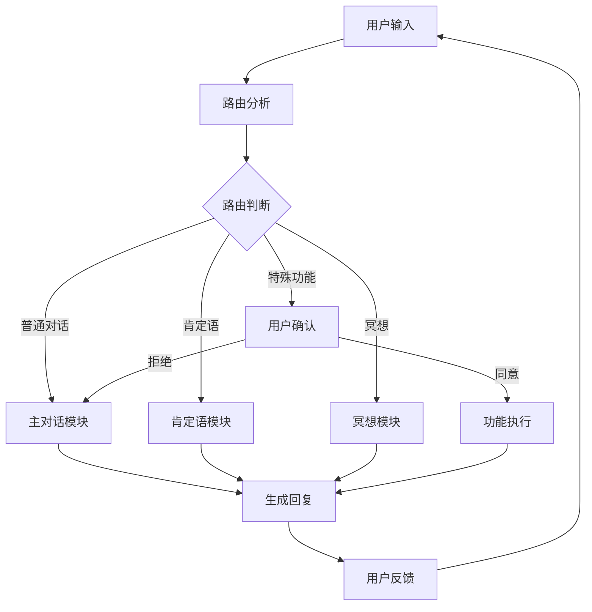

# 主对话 Agent

## 核心定位
主对话 Agent 作为吸引力法则与显化指导的核心智能体，承担着教练、规划师、支持者和追踪者的多重角色。

## 对话流程


# 功能模块

### 1. 路由分析
- 识别用户意图类型（普通对话/肯定语/冥想）
- 严格区分功能讨论和功能使用
- 确保用户明确同意后才触发特殊功能
- 默认保持在普通对话模式

### 2. 主对话模块
- 处理日常交互对话
- 提供情感支持和建议
- 回答用户疑问
- 引导用户使用其他功能

### 3. 肯定语模块
- 提供积极肯定的语句
- 生成个性化的肯定语
- 跟踪用户反馈
- 调整肯定语内容

### 4. 冥想模块
- 提供冥想引导
- 生成冥想音频
- 跟踪冥想进度
- 收集冥想反馈

### 5. 多模块协作
- 模块间平滑切换
- 状态保持与恢复
- 用户确认机制
- 会话上下文管理

## 对话策略

### 1. 语言风格
- 温暖友善
- 专业权威
- 积极鼓励
- 适度幽默

### 2. 互动技巧
- 主动倾听
- 共情回应
- 引导式提问
- 及时肯定

### 3. 特殊情况处理
- 情绪低落时的支持策略
- 遇到挫折时的鼓励方式
- 目标偏离时的纠正方法
- 动力不足时的激励手段

## 技术实现

### 1. 状态管理
```python
class OverallState(BaseModel):
    messages: List[AnyMessage]  # 对话历史
    route: Literal["affirmation", "meditation", "normal_chat"]  # 当前路由
    log: List[str]  # 系统日志
```

### 2. 核心工作流
```python
# 初始化模型
llm = ChatOpenAI(model="deepseek-chat")

# 构建主对话图
main_dialogue_workflow = StateGraph(OverallState)

# 添加核心节点
main_dialogue_workflow.add_node("router_node", router_node)
main_dialogue_workflow.add_node("user_feadback_agent", user_feadback_agent)
main_dialogue_workflow.add_node("normal_chat_agent", normal_chat_agent)
main_dialogue_workflow.add_node("affirmation_agent", affirmation_agent)
main_dialogue_workflow.add_node("meditation_agent", meditation_agent)

# 设置条件路由
main_dialogue_workflow.add_conditional_edges(
    "router_node",
    router_condition_edge,
    {
        "user_feadback_agent": "user_feadback_agent",
        "normal_chat_agent": "normal_chat_agent"
    }
)
```

### 3. 路由策略
- 默认返回 "normal_chat"
- 通过 router_node 分析用户意图
- 特殊功能需要用户确认
- 功能执行后返回普通对话

## 评估指标
1. 对话完成率
2. 用户满意度
3. 目标达成率
4. 情感共鸣度
5. 建议采纳率

## 持续优化
- 收集用户反馈
- 分析对话数据
- 优化回复策略
- 更新知识库